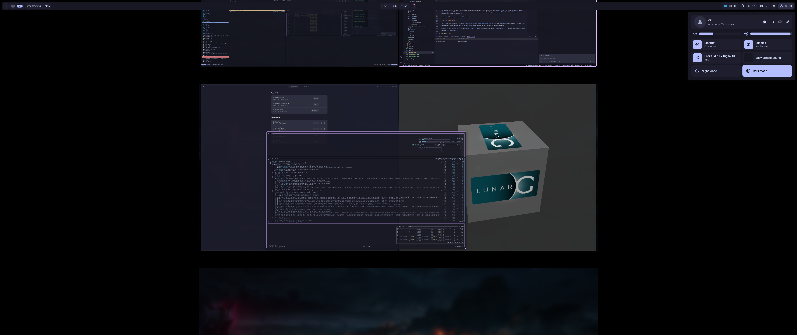

# pimp-my-cachyos

Automate [CachyOS Linux](https://cachyos.org/) setup and configuration using scripts and dotfiles.

After running it, you should have a ready-to-use CachyOS Linux with all the tools and customization that I prefer :).

## Motivation

CachyOS already comes with tons of baked-in optimization. This repo aims to further set it up and provide an out of the box (and opinionated) experience, ready to be used as daily driver.

It also takes care of many quirks and gotchas that I have found along the way.

## Software

The following is not an exaustive list, but a highlight of what will be installed and partially configured. These may change over time.

- Shell: `zsh`, `kitty` (default), `ghostty`, `oh-my-posh`, `atuin`, `zoxide`, `mise`, `television`, `fzf`, `bat`, `eza`, `fd`, `ripgrep`, `yazi`, `mc`, `btop`, `htop`, `procs`
- Unified desktop environment, with consistend look and feel across GTK/QT applications
  - Themes: `Scratchy` and `Catppuccin` variants
  - Icons: `Qogir`
  - Cursors: `Bibata Modern Amber`
  - Fonts: `Roboto`, `JetBrainsMono Nerd Font`
- Secret management: `KeePassXC` (integrates with the browser, with ssh-agent and acts as a system wallet)
- Web browser: `Brave`
- Mail client: `Betterbird` (enhanced Thunderbird fork)
- Office suite: `ONLYOFFICE` (closer to MS Office than LibreOffice, and lighter)
- Productivity: `AnyType`
- Editors: `VS Code`, `Zed`
- Gaming: `Steam`
- Windows OS compatibility: `proton-cachyos`, `Bottles` (most Windows games work with Proton layer, most Windows native apps work with Caffe layer)
- Virtualization: `QEMU`, `Virt-Manager`, `Looking Glass`
- Containers: `docker`
- Backup and recovery: `kopia` & `kopia-ui`, `syncthing` & `syncthing tray`, `rsync` & `grsync`, `snapper` & `btrfs assistant` (btrfs snapshots)

## Usage

1. Install CachyOS. I prefer the following:
   1. Bootloader: **Grub** (allows multiboot with other OS and can load previous snapshots)
   2. Filesystem: **BTRFS**
      - It supports snapshots, and as Arch based distros are rolling release, it is a good idea to have them. `snap-pac` will automatically create snapshots before and after a package upgrade.
      - `grub-btrfs` can be used to add menu with snapshots to choose at boot, in case of system breakage.
   3. Desktop environment: **KDE Plasma**
   4. **No swap**. I normally use plenty of RAM on my machines. I would have programs OOM Killed than have the system slow down and have SSD wear out faster.

2. Clone this repo: `git clone https://github.com/thedataflows/pimp-my-cachyos.git && cd pimp-my-cachyos`
   - Install mise: `sudo pacman -Sy mise --noconfirm --needed`
   - Show all available tasks: `mise tasks` or `mr` (alias)
   - Run all setup: `mise run all` or `mr all`
   - Individual tasks can be run as well: `mr packages:add`, `mr system:grub`, etc.
   - Add files to this repo: `mr files:add directory-or-file-path`

3. Reboot the system at least after the first run.

## Secrets management

I decided to use KeePassXC as a password manager, because it is portable, has a good browser integration, and can act as a system wallet replacing KDE Wallet and GNOME Keyring.

> [!WARNING]
> This repo will disable Kwallet

- <https://wiki.archlinux.org/title/KeePass#Autostart>
- <https://code.visualstudio.com/docs/editor/settings-sync#_other-linux-desktop-environments>

## Desktop Experience

### KDE Plasma (default)

I liked the look and feel of modern Gnome, but I wanted more control over the desktop. Also, some of the most used apps are QT (KDE is built with QT) and had to do some customization specifically for them.

So I decided to give KDE Plasma a go. I was surprised by how smooth it runs and how easy it was to customize the desktop the way I wanted it:

- Hidden top panels and bottom bar because I use an OLED screen.
- `Scratchy` global theme with Bibata Modern Amber cursor.
- Tray icons out of the box
- Better HiDPI support with fractional scaling (much needed when using a 4K screen), especially with the latest KDE Plasma.
- Better and richer apps compared to Gnome (System Settings, System Monitor, KRunner, Dolphin, Gwenview, Okular, etc.)


### Tiling WM: Niri + Dank Material Shell (DMS)

An alternative tiling desktop environment available at login (via Plasma Login Manager), alongside the default KDE Plasma. It is fully functional and can be used as a daily driver for me, yet. KDE Plasma is amazing, and the memory footprint is as low as Niri+DMS.

**Niri** is a scrollable-tiling Wayland compositor that provides a unique workflow where windows are arranged in a scrollable column layout. Combined with **Dank Material Shell (DMS)**, it offers a fairly complete desktop experience with integrated widgets, launcher, notifications, and system monitoring.

Use `Niri (qt6ct)` session at login to use it. It is not the default session, because it has some quirks and issues, see below.

#### Key features

- Text seems sharper compared to KDE Plasma!
- Scrollable-tiling layout as default, fast and buttery smooth.
- DMS provides: top widget panel and bottom docking panel, application launcher (Super+Space), clipboard manager (Super+V), task manager/dgop (Super+Shift+Esc), notification center (Super+N), etc. Ctrl+Shift+/ show a list of the main shortcuts. For all my keybindings, see [binds.kdl](symlink/~/.config/niri/dms/binds.kdl)
- Catppuccin Mocha theme throughout
- Uses existing KeePassXC for secrets (no kwallet)
- Using KDE portal for integration, using the same KDE file dialogs, etc. Also uses KDE polkit agent for step-up authentication dialogs.
- Fully integratable with dsearch (filesystem search) and dgop (system monitoring) - not use by me though, prefer KRauncher and Btop still.




### Other Desktop Environments

#### Omarchy... Nope

#### Budgie

Gnome based, really enjoyed the simple look and feel. It is quite light and fast.

Unfortunately, is also lagging behind the pack, not very polished and riddled with issues (like the annoying bug in the lockscreen that is also a security risk).

Hoping for a comeback with Cosmic. Tried the beta, is nice, but still far to simplistic for me, and not in a good way. DMS is quite basic, but somehow feels functional.

#### Gnome

I used Gnome for some time, but it felt sluggish, laggy and most gnome apps are oversimplified so I ended up replacing them.

Customization is limited, can be achieved with some extensions that are stable most of the time, but it feels like an afterthought. Finally, software updates are not that often, and when they happen, stuff breaks (like it happened after upgrade from Gnome 46 to 47).

Discouraged by some crashes and freezes.

## Why YAML and mise?

YAML is easier to parse with tools like [yq](https://mikefarah.gitbook.io/yq) and human-readable. Package definitions support host-specific filtering, allowing the same config to work across multiple machines.

[mise](https://mise.jdx.dev/) provides a simple task runner with environment management. It's faster and more flexible than make or taskfile.

### Why not nix?

I don't yet like it and do not have the time to learn it.

## Design

- `mise-tasks/` contains bash scripts organized by functionality (packages, system, apps, network, etc.) that are used by mise tasks
- `packages/*.yaml` defines packages to install, with optional host-specific filtering
  - Format:

    ```yaml
    - name: package-name # or "aur/package-name" for AUR packages
      desc: Description of the package
      hosts: # optional, if not present installs everywhere
        - hostname1
        - hostname2
      state: present # or absent
    ```

  - Package scripts automatically filter by hostname - packages without `hosts` field install everywhere, those with `hosts` array only install on matching machines

  - Package scripts automatically filter by hostname - packages without `hosts` field install everywhere, those with `hosts` array only install on matching machines

## License

[MIT](LICENSE)
