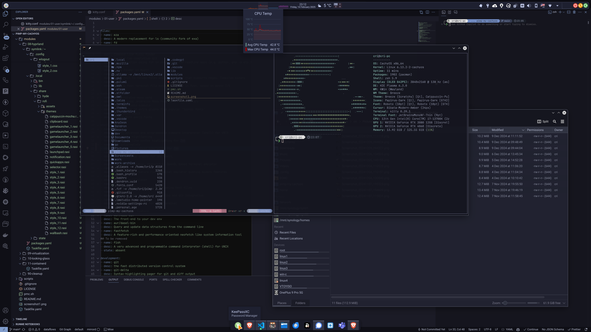

# pimp-my-cachyos

Automate [CachyOS Linux](https://cachyos.org/) setup and configuration.

After running it, you should have a fully functional CachyOS Linux with all the tools and customization that I preffer :).

## Motivation

CachyOS already comes with tons of baked-in optimization. This repo aims to further set it up and provide an out of the box experience, ready to be used as daily driver.

It also takes care of many quirks and gotchas that I have found along the way.

## Software

The following is not an exaustive list, but a highlight of what will be installed and partially configured. These may change over time.

- Shell: `zsh`, `kitty`, `oh-my-posh`, `atuin`, `zoxide`, `direnv`, `fzf`, `bat`, `exa`, `fd`, `ripgrep`, `yazi`, `btop`, `htop`, `procs`
- Unified desktop environment, with consistend look and feel across GTK/QT applications
  - Themes: `Scratchy` and `Catppuccino` variants
  - Icons: `Papirus Dark`
  - Cursors: `Bibata Modern Amber`
  - Fonts: `Quicksand`, `JetBrainsMono Nerd Font`
- Secret management: `KeePassXC` (integrates with the browser, with ssh-agent and acts as a system wallet)
- Web browser: `Brave`
- Mail client: `Thunderbird`
- Office suite: `ONLYOFFICE`
- Productivity: `AnyType`, `superProductity`
- Editors: `VS Code`, `Zed`
- Gaming: `Steam`
- Windows OS compatibility: `Bottles` (most Windows games work with Proton layer, most Windows native apps work with Caffe layer)
- Virtualization: `QEMU`, `Virt-Manager`, `Looking Glass`
- Containers: `containerd`, `nerdctl`, `kubectl`
- Backup and recovery: `kopia`, `syncthing`, `rsync`, `snapper` (btrfs snapshots)

## Usage

1. Install CachyOS. I preffer the following:
   1. Bootloader: **Grub** (allows multiboot with other OS)
   2. Filesystem: **BTRFS**
      - It supports snapshots, and as Arch is a rolling release, it is a good idea to have them. `snap-pac` will automatically create snapshots before and after a package upgrade.
      - `grub-btrfs` can be used to add menu with snapshots to choose at boot, in case of system breakage.
   3. Desktop environment: **KDE Plasma**
   4. **No swap**. I normally use plenty of RAM on my machines. I would have programs OOM Killed than have the system slow down.

2. Clone this repo: `git clone https://github.com/thedataflows/pimp-my-cachyos.git && cd pimp-my-cachyos`

   - Show all the tasks: `./pmc.sh`
   - Run all: `./pmc.sh all`. Run as regular user with sudo privileges (most probably user id 1000).

   Individual tasks can be run as well, if needed: `go-task -t modules/00-network`

3. Reboot the system at least after the first run.

## Desktop Experience

### KDE Plasma (default)

I liked the look and feel of modern Gnome, but I wanted more control over the desktop. Also, some of the most used apps are QT (KDE is built with QT) and had to do some customization specifically for them.

So I decided to give KDE Plasma a go. I was surprised by how smooth it runs and how easy it was to customize the desktop the way I wanted it:

- Hidden top panels and bottom bar because I use an OLED screen.
- `Scratchy` global theme with Bibata Modern Amber cursor.
- Tray icons out of the box
- Better HiDPI support with fractional scaling (much needed when using a 4K screen)
- Better and richer apps compared to Gnome (System Settings, System Monitor, KRunner, Dolphin, Gwenview, Okular, etc.)

### Budgie

Gnome based, really enjoyed the simple look and feel. It is quite light and fast.

Unfortunately, is also lagging behind the pack, not very polished and riddled with issues (like the annoying bug in the lockscreen that is also a security risk).

Trying a comeback with Cosmic.

### Gnome

I used Gnome for some time, but it felt sluggish, laggy and most gnome apps are oversimplified so I ended up replacing them.

Customization is limited, can be achieved with some extensions that are stable most of the time, but it feels like an afterthought. Finally, software updates are not that often, and when they happen, stuff breaks (like it happened after upgrade from Gnome 46 to 47).

Discouraged by some crashes and freezes.

### Tiling Window Managers

Gave Hyprland a go, but having a HiDPI display and wanting scaling, proved to be an ugly experience (pixelated fonts or very tiny output). Liked the simplicity and speed though, but it not yet for me.

## Why yaml and taskfile.dev?

Just using shell scripts works, but I have always found it cumbersome to maintain.

I believe that using taskfile (a better Makefile alternative) helps with the structure, readability and composability.

Yaml is easier to parse and filter with tools like [yq](https://mikefarah.gitbook.io/yq), and human readable when compared to json. Thought about TOML, but I am not yet satisfied with existing editing tools for scripting.

## Design

- `pmc.sh` is a wrapper around `go-task` that allows to run all tasks with a single command.
- `lib/` directory contains common functions and variables used across tasks.
- `scripts/` directory contains helper shells scripts.
- `modules/` directory contains independent sets of tasks, groupped by what they accomplish. The idea is for them to be self contained, with little or no dependencies between eachother.

`Taskfile.yaml` is the main entry point for each module, and it is responsible for defining the tasks and their dependencies. The tasks inside such a file run commands that accept other tasks or shell scripts (via [Gosh](https://github.com/mvdan/sh), a shell parser, formatter, and interpreter. Supports POSIX Shell, Bash, and mksh).

## License

[MIT](LICENSE)
